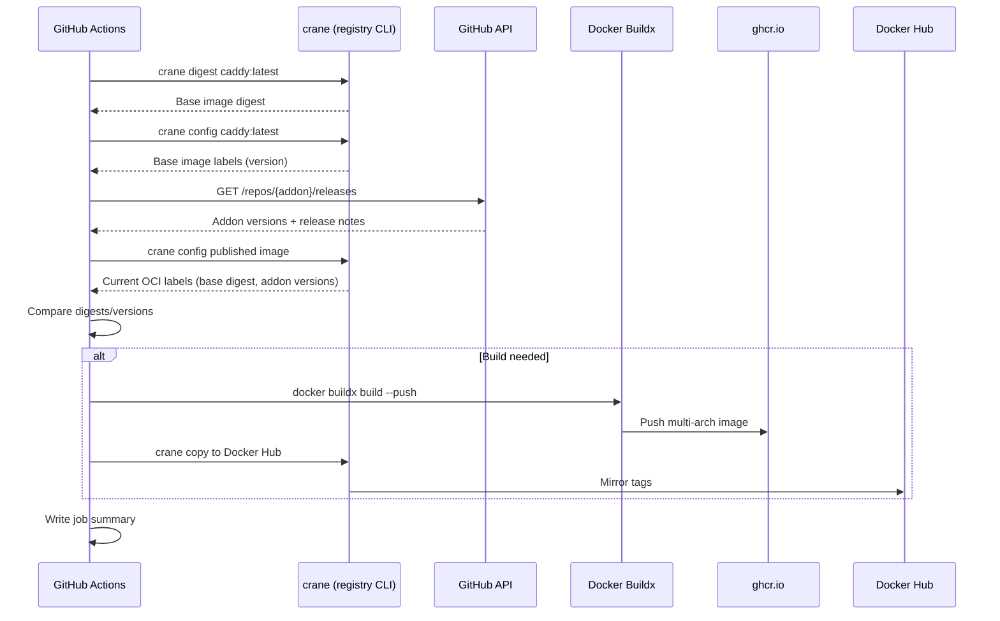

# Architecture Overview

## System Context

```
┌─────────────────┐     ┌──────────────────┐     ┌─────────────────┐
│  Upstream       │     │  Build Pipeline  │     │  Registries     │
│  (Caddy, Addons)│────▶│  (GitHub Actions)│────▶│  (GHCR + Docker)│
└─────────────────┘     └──────────────────┘     └─────────────────┘
                               │
                               ▼
                        ┌──────────────────┐
                        │  OCI Image Labels│
                        │  (Traceability)  │
                        └──────────────────┘
```

## Core Components

### 1. Multi-Stage Dockerfile (`Dockerfile-cloudflare`)

**Build Stage** (`caddy:builder`):
- Uses `xcaddy` to compile Caddy with declared addons
- Each `--with` line adds a Go module at compile time
- Produces custom `/usr/bin/caddy` binary

**Final Stage** (`caddy:latest`):
- Copies only the compiled binary from builder
- Inherits Caddy's runtime configuration (entrypoint, user, etc.)
- Adds OCI labels for traceability

```dockerfile
# Build stage
FROM caddy:builder AS builder
RUN xcaddy build \
    --with github.com/caddy-dns/cloudflare \
    --with github.com/WeidiDeng/caddy-cloudflare-ip \
    --with github.com/fvbommel/caddy-combine-ip-ranges \
    --with github.com/lucaslorentz/caddy-docker-proxy/v2

# Final stage
FROM caddy:latest
COPY --from=builder /usr/bin/caddy /usr/bin/caddy
```

### 2. GitHub Actions Workflow (`.github/workflows/build_cloudflare-modules.yaml`)

Single `build` job with these phases:

| Phase | Purpose | Key Steps |
|-------|---------|-----------|
| **Classify Changes** | Detect local file changes | `local_changes` step |
| **Setup** | QEMU, Buildx, GHCR login | `setup-qemu-action`, `setup-buildx-action`, `docker/login-action` |
| **Decide Build** | Fetch upstream versions, compare with published image | `decide` step (bash script) |
| **Metadata** | Generate tags and labels | `docker/metadata-action`, `addon_labels` step |
| **Build & Push** | Multi-arch build via Buildx | `docker/build-push-action` |
| **Mirror** | Copy tags to Docker Hub (optional) | `crane copy` |
| **Summary** | Write job summary | `cat /tmp/summary.md` |

### 3. Addon Discovery (Dynamic)

The workflow **parses the Dockerfile** at runtime to discover active addons:

```bash
grep -- '--with' Dockerfile-cloudflare | \
  while IFS= read -r line; do
    # Skip commented lines
    [[ "$line" =~ ^[[:space:]]*# ]] && continue
    # Extract addon: --with github.com/owner/repo
    [[ "$line" =~ --with[[:space:]]+([^[:space:]\\]+) ]]
  done
```

This means **adding a `--with` line automatically integrates it** into version fetching, labeling, and change detection.

## Data Flow



## Adding a New Image Variant

Each variant is self-contained with exactly two files:

| File | Purpose |
|------|---------|
| `Dockerfile-<name>` | Declares modules via `--with` lines |
| `.github/workflows/build_<name>.yaml` | Builds, tags, publishes the image |

**Steps to add a variant:**
1. Copy `Dockerfile-cloudflare` → `Dockerfile-<name>`, adjust `--with` lines
2. Copy `.github/workflows/build_cloudflare-modules.yaml` → `.github/workflows/build_<name>.yaml`
3. Update hardcoded image name in workflow (`ghcr.io/smoochy/caddy-<name>`)
4. Update `file:` reference from `Dockerfile-cloudflare` to `Dockerfile-<name>`
5. Add to Available Images table in README.md

## Extension Points

| Extension | Location | Mechanism |
|-----------|----------|-----------|
| New Caddy module | `Dockerfile-<variant>` | Add `--with github.com/owner/repo` line |
| New image variant | Repository root | Two-file pattern above |
| Build trigger | Workflow `on:` section | Push paths, schedule, workflow_dispatch |
| Registry target | Workflow `registries` step | Add secrets, extend mirror logic |
| OCI label | Workflow `addon_labels` / `build-push` | Dynamic label generation from discovered addons |

## Invariants

- **Minimal final image**: Only the custom Caddy binary is copied; no build tools in final layer
- **Reproducible builds**: Same Dockerfile + same base digest + same addon versions = identical binary
- **Dynamic addon tracking**: Workflow discovers addons from Dockerfile, no hardcoded list
- **Multi-arch by default**: `linux/amd64`, `linux/arm64`, `linux/arm/v7`

## Key Responsibilities and Control Flow

### Build Decision Logic (`decide` step)
The workflow performs a sophisticated change detection:

1. **Local Change Classification**: Detects if Dockerfile, `.dockerignore`, or workflow files have changed
2. **Upstream Version Fetching**: 
   - Gets Caddy base image digest and version from `caddy:latest`
   - For each discovered addon, fetches latest release tag or commit SHA from GitHub API
3. **Change Comparison**: 
   - Compares current published image digest/version with upstream
   - Determines if rebuild is needed based on forced conditions or actual changes
4. **Build Trigger Decision**: Only proceeds with build if changes detected or forced

### Multi-Stage Build Process
1. **Builder Stage**: `xcaddy` compiles Caddy with all declared addons, statically linking them
2. **Runtime Stage**: Copies only the compiled binary to minimal Caddy runtime image
3. **Layer Optimization**: Final image contains zero build tools, only the custom Caddy binary

### OCI Labeling Strategy
- **Static Labels**: Base image metadata (title, description, source, etc.)
- **Dynamic Labels**: Per-addon name/version for change tracking
- **Traceability Labels**: Base digest, version, and complete addon versions for reconstruction
- **Legacy Compatibility**: Preserves `org.opencontainers.image.cloudflare.version` for backward compatibility

### Publishing & Mirroring
- **Primary Registry**: GHCR with two tags (`latest` and `caddy-<version>`)
- **Mirror Strategy**: Optional Docker Hub mirror when credentials are configured
- **Change-Based Publishing**: Only publishes when upstream components actually change
- **Multi-Arch Support**: Builds for amd64, arm64, and arm/v7 using Buildx

## Failure Handling and Invariants

### Build Failure Recovery
- **Local Changes**: Pull request validation runs builds even if no upstream changes
- **Force Override**: Manual workflow dispatch can force rebuild regardless of state
- **Schedule Check**: Daily upstream checks ensure timely updates

### Data Consistency Invariants
- **Deterministic Builds**: Same inputs always produce identical binary
- **Label Consistency**: All labels accurately reflect the built image contents
- **Change Detection**: Precise comparison prevents unnecessary rebuilds
- **Multi-Arch Integrity**: All platforms receive the same binary content

## Extension Mechanisms

### Adding New Modules
1. Add `--with github.com/owner/repo` line to Dockerfile
2. Workflow automatically discovers and processes
3. No manual updates to workflow needed

### Adding New Variants
1. Copy Dockerfile and workflow files
2. Customize module set for specific use case
3. Each variant is completely independent

### Extending Registry Support
1. Update `registries` step in workflow
2. Add new secrets for target registry credentials
3. Extend mirror logic as needed

## Testing and Validation

The system validates through:

1. **Local Build Testing**: `docker build -f Dockerfile-cloudflare .` for syntax and basic functionality
2. **GitHub Actions Testing**: PR validation runs complete build pipeline
3. **Label Validation**: Verification of all OCI labels contain expected values
4. **Multi-Arch Testing**: Buildx creates platforms for amd64, arm64, and arm/v7
5. **Change Detection Testing**: Verification that upstream change detection works correctly

## System Boundaries and Integration Points

### External Dependencies
- **Caddy Upstream**: `caddy:latest` builder and runtime images from caddyserver/caddy
- **Addon Modules**: Go modules from various GitHub repositories
- **Registry Services**: GHCR and optionally Docker Hub
- **CI/CD Platform**: GitHub Actions for automation

### Internal Component Interfaces
- **Dockerfile**: Declarative interface for module selection
- **Workflow Scripts**: Procedural interface for build decision and version fetching
- **OCI Labels**: Structured data interface for traceability
- **Build Outputs**: Container image interface for downstream consumption

### Data Flow Boundaries
- **Build Context**: Limited to repository root for security
- **Registry Access**: Limited to specific image repositories
- **GitHub API Rate Limits**: Respects API quotas with fallbacks
- **Network Access**: Required for fetching upstream versions
